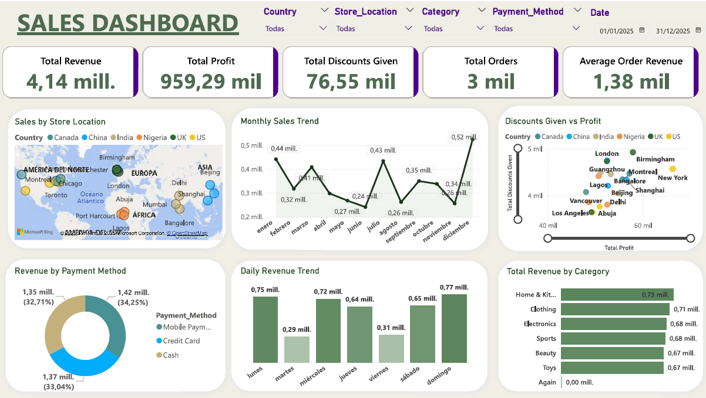
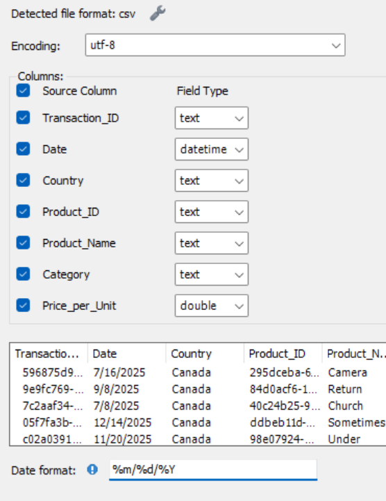
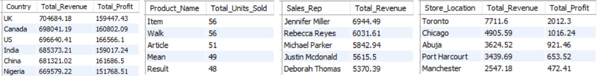

# SQL & PowerBi Project.

<h1>📊 Executive Sales Dashboard with SQL & Power BI </h1>
<p>
	This project focuses on preparing, cleaning, and analyzing sales data using SQL and building a real-time, executive-oriented dashboard using Microsoft Power BI.
    <p align="center">
  
</p>
---
<h2>🛠️ Data preparation with SQL</h2>
<i>1. Importing data </i> <br>
The original dataset was reviewed in Excel to understand its structure, identify irrelevant columns, and check for data types.
<p>
The data was then imported into **MySQL**, ensuring the correct formats were applied—especially for dates (e.g., `%m/%d/%Y`).
</p>


---
<i>2. Data Cleaning</i> <br>
All cleaning steps were performed using SQL. The full script is available in the project files.
**Steps included:**
1. **Removing duplicates**
- No duplicates were found. If needed:
```sql
DELETE FROM sales_data2_copy WHERE row_num > 1;
```
2. **Standardizing data**
- No spelling issues, extra spaces, symbols, etc. If any, we could proceed as follows:
- Spaces before words:
```sql
SET Country = TRIM(Country);
```
- Similar words:
```sql
SET Country = ‘Canada' WHERE Country LIKE ‘Canad';
```
- Symbols or dots at the end:
```sql
TRIM(TRAILING '.' FROM Country) WHERE Country LIKE 'Canada%';
```
3. **Handling Null or missing values**
- No null values were found in the dataset. If any had been present, they would have been addressed using context-appropriate methods such as imputation or row removal. For example, missing product prices could be filled using the average price of the same item in the same store, or across other stores. Similarly, missing categories could be inferred based on similar products.
4. **Removing rellevant Columns/Rows**
- Example:
```sql
ALTER TABLE sales_data2 DROP COLUMN row_num;
DELETE FROM sales_data2 WHERE product IS NULL;
```
<i>3. Analyzing data </i> <br>
Before moving to Power BI, we ran exploratory analysis via SQL. The script calculates key metrics like **Total Revenue** and **Profit**:
```sql
ALTER TABLE sales_data2 ADD COLUMN Total_Revenue DOUBLE;
UPDATE sales_data2 SET Total_Revenue = (Price_Per_Unit * Quantity_Purchased) - Discount_Applied;

ALTER TABLE sales_data2 ADD COLUMN Profit DOUBLE;
UPDATE sales_data2 SET Profit = Total_Revenue - (Cost_Price * Quantity_Purchased);
```
As seen in the script, The analysis focuses on 4 aspects:
- Total revenue & profit by country.
- Top 5 best-selling products.
- Top 5 representatives.
- Best-performing store locations from the last stored week.

---
<h2>Power BI Dashboard Development</h2>
<i>1. Importing Cleaned Data </i> <br>
Cleaned data was imported into Power BI as .csv or directly from the MySQL database. 
<i>2. data Transformation with DAX </i> <br>
New measures created: **Total Revenue, Total Profit, Total Discounts Given, and Average Order Revenue**.
<p>
Additional columns: **Month Name, Month Number, Day Name, Day Number** — useful for chronological charts and trend lines.
</p>
<i>3. Dashboard Design </i> <br>
Design principles:
- Focused on executive-level KPIs.
- Key metrics displayed using value cards: Total Revenue, Total Profit, Total Orders, etc.
Visuals include:
- Bar charts (e.g., daily revenue, revenue by category)
- Line charts (e.g., monthly trends)	
- Map charts and scatter plots
- Filters for dynamic analysis (e.g., by country or store)
<p align="center">

</p>
<i>4. Insights  Findings </i> <br>
Some key observations:
- December shows the highest revenue—likely due to holiday shopping.
- Tuesdays and Fridays have the lowest sales—could inform operational decisions like store maintenance or training days.
- There is a linear relationship between profit and discounts, which could be further explored using Python or advanced analytics tools.
- Payment methods are evenly distributed.
Further insights can be uncovered using Power BI filters to segment by country, store, or product category.